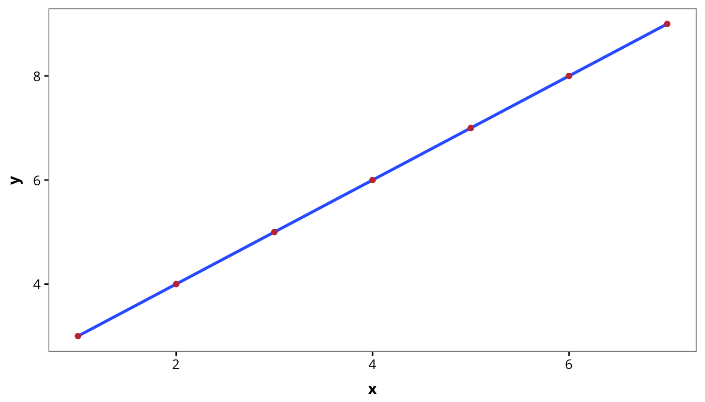
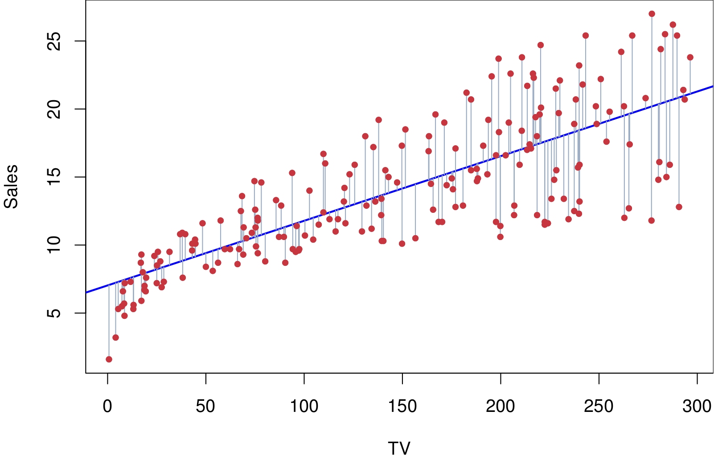
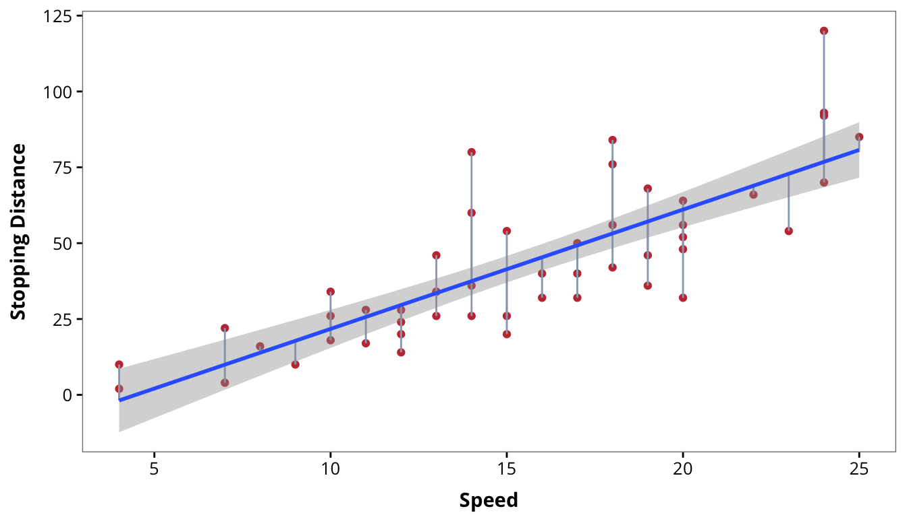
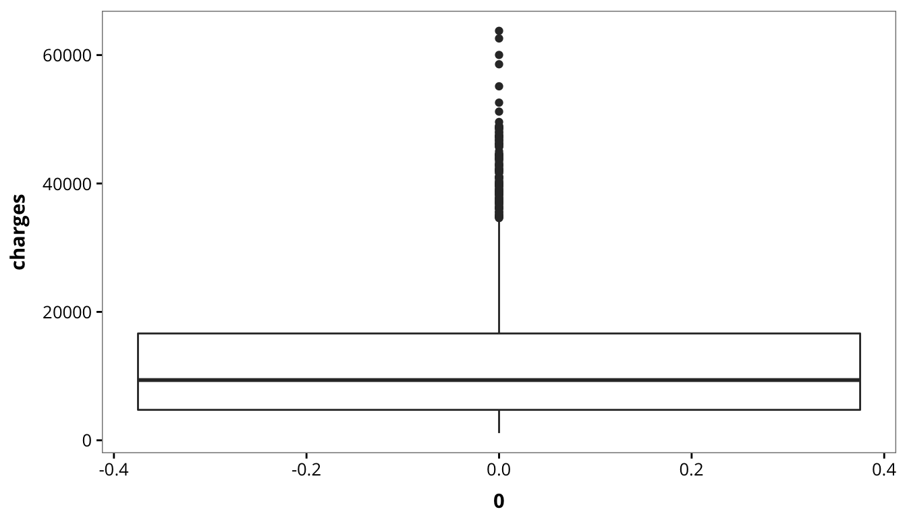
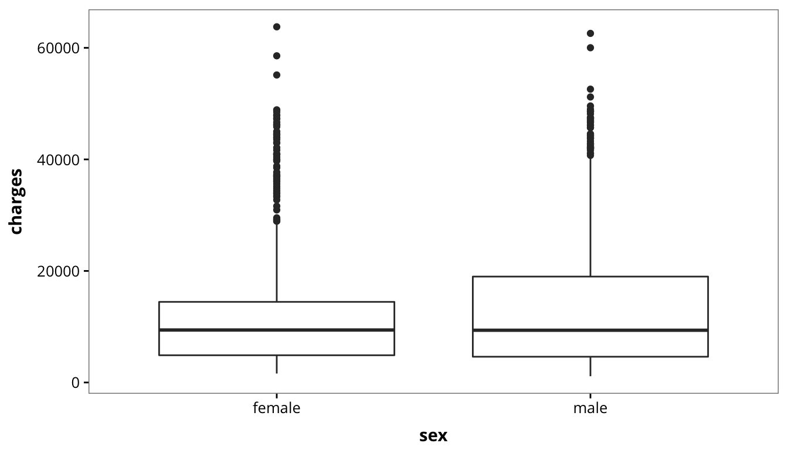
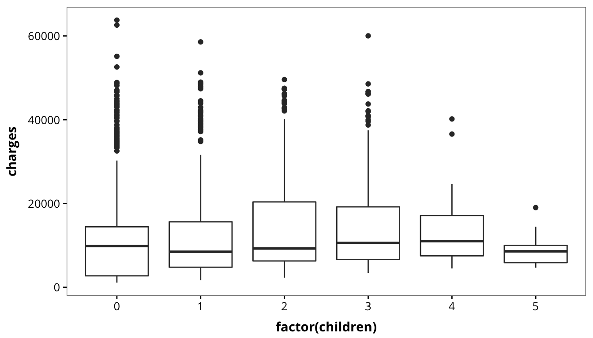
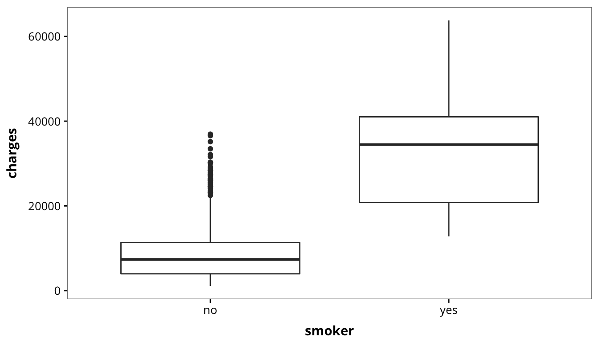
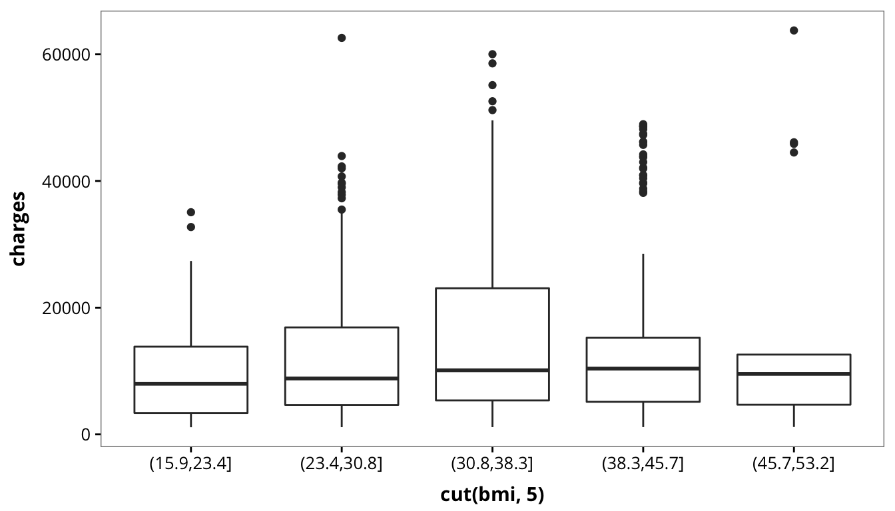
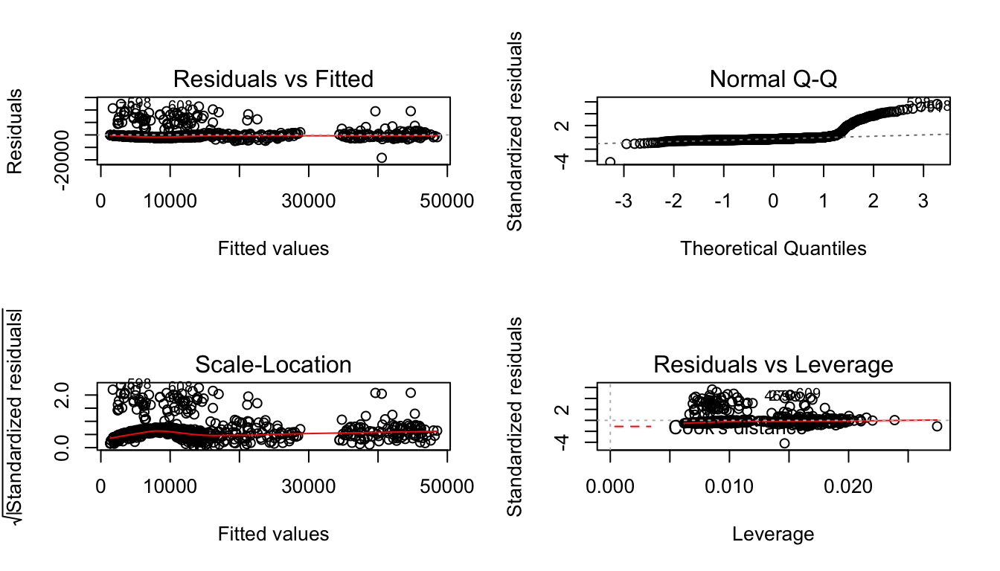

Linear Regression
================
Jaeyoon Han

선형회귀법(Linear Regression)[1]
================================

단순해보이지만 굉장히 깊이 있는 통계학 기반의 기계학습 방법인 선형회귀법에 대해서 알아보도록 하겠습니다. 선형회귀법은 *독립변수(independent variable)*와 *종속변수(dependent variable)* 사이의 관계를 모델링하는 기법을 말합니다. 한 변수(독립변수)의 변화로부터 다른 변수(종속변수)가 어떻게 변하는 지 예측하는 기법이 선형회귀법입니다. 이 때 독립변수의 개수가 하나인 경우 **단순 선형 회귀(Simple Linear Regression)**, 독립변수가 두 개 이상인 경우 **다중 선형 회귀(Multiple Linear Regression)**라고 부릅니다. 독립변수 $Y$와 종속변수 $X_1, X_2, \cdots, X_n$에 대하여 다음과 같이 나타낼 수 있습니다. $$
Y \approx \beta_0 + \beta_1 X_1 + \beta_2 X_2 + \cdots + \beta_n X_n. \tag{1}
$$

예를 들어, $X = (1, 2, 3, 4, 5, 6, 7)$에 대하여 $Y = (3, 4, 5, 6, 7, 8, 9)$의 관계를 나타낸다면
$$
Y = X + 2
$$
로 나타낼 수 있습니다.

``` r
library(dplyr)
library(ggplot2)

data.frame(x = 1:7, y = 3:9) %>% ggplot(aes(x = x, y = y)) + geom_smooth() + 
    geom_point(colour = "#C53842")
```



이 경우, 만약 새로운 $X$값인 8이 들어온다면 손쉽게 $Y$값은 10이라고 예측할 수 있습니다. 실제로는 이렇게 단순하게 모델링되는 경우는 거의 존재하지 않습니다. 조금 더 실제 상황에 맞는 데이터를 확인해보겠습니다.

밑의 그래프는 TV 광고량에 대한 매출 데이터를 선형회귀법을 이용해 모델링한 결과물입니다.

<center>

</center>

수많은 데이터 사이에 그어져 있는 파란선이 **회귀선(Regression Line)**입니다. 데이터를 기반으로 알아낸 예측값들을 나타내는 선이죠. 점들 사이에 적당하게 파란선을 그으면 회귀선이 될 수 있지 않을까하는 의심이 들 수 있습니다. 하지만 그래프에 있는 파란선은 엄밀한 수학적 근거에 기반을 둔 결과입니다.

각각의 점은 파란선까지의 거리가 회색선으로 표현되어 있습니다. 각각의 데이터 점의 $y$좌표를 $y_i$라고 하고, 그에 해당하는 파란선 위의 점의 $y$좌표를 $\hat{y}_i$라고 할 때, 그 차이값을 $e_i$로 두겠습니다. 이 값을 **잔차(residual)**라고 합니다. 쉽게 말해서 오차값입니다. 이 값이 작을 수록 더 좋은 예측을 했다고 볼 수 있습니다. 실제값과 예측값의 차이가 작기 때문이죠. 모든 데이터 점과 파란선 사이에는 잔차값이 있습니다. 이 값들을 각각 제곱해서 더하면 다음과 같습니다. $$
RSS = e_1^2 + e_2^2 + \cdots + e_n^2. \tag{2}
$$ 그 값을 **잔차제곱합(Residual sum of squares, RSS)**이라고 합니다. 이 값이 최소가 되는 회귀선이 바로 위 이미지에서 파란선이 됩니다. 이 쯤 되면, 선형회귀의 모든 것에 대해서 알게된 것 같지만, 선형회귀법에는 많은 전제와 가정이 따릅니다.

-   독립변수 $X$는 고정된 값이다.
-   오차항의 분산이 동일하다.
-   오차항간 상호 독립이다.
-   오차항의 평균은 0이며, 분산은 $\sigma^2$인 정규 분포를 따른다.
-   독립변수간 독립이다.
-   종속 변수와 독립변수간 수식 (1)이 성립한다.

이 조건들은 저절로 성립하는 것이 아니라, 만들어진 모형을 검증하여 부족한 점이 없는지 확인하거나, 독립변수와 종속변수를 변환하여 위 조건을 만족하도록 해야 합니다.

이제 R을 이용해서 선형회귀법을 실습해보도록 하겠습니다. 여러 가지 데이터가 필요하기 때문에, 다음의 패키지를 설치하겠습니다.

``` r
# install.packages('MASS')
library(MASS)
```

처음 해 볼 실습은 차량 관련 데이터를 활용한 단순선형회귀입니다. `cars` 데이터는 R에 내장되어 있는 데이터로, 차량의 속도에 따른 정지거리를 기록한 데이터입니다. 데이터에 대한 자세한 설명은 `?cars`를 실행하여 확인할 수 있습니다.

``` r
data(cars)
head(cars)
```

      speed dist
    1     4    2
    2     4   10
    3     7    4
    4     7   22
    5     8   16
    6     9   10

`cars` 데이터에서 `speed`는 차량의 속도, `dist`는 정지거리를 의미합니다. 선형회귀는 `lm()` 함수를 사용해서 모델링할 수 있습니다. 사용법은 다음과 같습니다.

        lm(formula, data, ...)

`formula`는 선형회귀 모델에 대한 공식을, `data`는 사용할 데이터를 넣으면 됩니다. 일반적으로 정지거리는 속도가 빠를 수록 증가하므로, 다음과 같은 모델을 생각할 수 있습니다. $$
dist \approx \beta_0 + \beta_1 \times speed. \tag{3}
$$

위 공식을 `lm()` 함수의 `formula` 자리에 넣고 모델링을 해보도록 하겠습니다.

``` r
model <- lm(dist ~ speed, data = cars)
model
```


    Call:
    lm(formula = dist ~ speed, data = cars)

    Coefficients:
    (Intercept)        speed  
        -17.579        3.932  

모델링의 결과에 따르면 $\beta_0 = -17.579$, $\beta_1 = 3.932$가 나왔습니다. 다시 말해서 식 (3)은 아래 식 (4)와 같습니다.
$$
dist \approx -17.579 + 3.932 \times speed.
$$

본 모델의 내용들은 다음의 함수들을 이용해서 살펴볼 수 있습니다.

``` r
# 회귀 계수
coef(model)
```

    (Intercept)       speed 
     -17.579095    3.932409 

``` r
# 예측 값(Fitted values)
fitted(model)[1:6]
```

            1         2         3         4         5         6 
    -1.849460 -1.849460  9.947766  9.947766 13.880175 17.812584 

``` r
# 잔차(Residuals)
residuals(model)[1:6]
```

            1         2         3         4         5         6 
     3.849460 11.849460 -5.947766 12.052234  2.119825 -7.812584 

``` r
# 계수의 신뢰구간
confint(model)
```

                     2.5 %    97.5 %
    (Intercept) -31.167850 -3.990340
    speed         3.096964  4.767853

``` r
# 잔차제곱합(RSS)
deviance(model)
```

    [1] 11353.52

이 때, 예측값과 잔차의 합은 원래의 데이터값과 일치합니다.

``` r
fitted(model)[1:6] + residuals(model)[1:6]
```

     1  2  3  4  5  6 
     2 10  4 22 16 10 

``` r
cars$dist[1:6]
```

    [1]  2 10  4 22 16 10

``` r
cars %>% mutate(pred = -17.579 + 3.932 * speed) %>% ggplot(aes(x = speed, y = dist)) + 
    geom_point(colour = "#C53842") + geom_segment(aes(x = speed, y = dist, xend = speed, 
    yend = pred), colour = "#99A8BF") + geom_smooth(method = "lm") + xlab("Speed") + 
    ylab("Stopping Distance")
```



더 자세한 내용을 보기 위해서는 `summary()` 함수를 사용해야 합니다.

``` r
summary(model)
```


    Call:
    lm(formula = dist ~ speed, data = cars)

    Residuals:
        Min      1Q  Median      3Q     Max 
    -29.069  -9.525  -2.272   9.215  43.201 

    Coefficients:
                Estimate Std. Error t value Pr(>|t|)    
    (Intercept) -17.5791     6.7584  -2.601   0.0123 *  
    speed         3.9324     0.4155   9.464 1.49e-12 ***
    ---
    Signif. codes:  0 '***' 0.001 '**' 0.01 '*' 0.05 '.' 0.1 ' ' 1

    Residual standard error: 15.38 on 48 degrees of freedom
    Multiple R-squared:  0.6511,    Adjusted R-squared:  0.6438 
    F-statistic: 89.57 on 1 and 48 DF,  p-value: 1.49e-12

많은 내용이 나옵니다. 수학적인 내용을 최대한 배제하고 설명드리겠습니다.

1.  `Call` : 선형회귀 모델이 어떻게 생성되었는 지 보여줍니다.
2.  `Residual` : 실제 데이터와 모델 사이의 잔차를 보여줍니다. 잔차의 최솟값은 -29.069, 최댓값은 43.201로 나타났습니다.
3.  `Coefficients` : 생성된 모델의 회귀계수와 계수들의 통계적 유의성을 보여줍니다. 표준편차와 t-검정값, 그리고 이에 따른 p-value가 출력됩니다. 일반적으로 p-value가 0.05 미만일 때 통계적으로 유의하다고 이야기 합니다.
4.  `R-squared` : 모델이 데이터의 분산을 얼마나 설명하는 지 알려줍니다.
5.  `F-statistics` : 모델이 얼마나 통계적으로 의미가 있는지 보여줍니다.

이제 실제 데이터를 사용해서 선형회귀법을 실습해보겠습니다.

------------------------------------------------------------------------

실습 : 의료비 예측
==================


데이터 설명 (Data Description)
------------------------------

Blah Blah Blah

``` r
insurance <- read.csv("insurance.csv")
head(insurance)
```

      age    sex    bmi children smoker    region   charges
    1  19 female 27.900        0    yes southwest 16884.924
    2  18   male 33.770        1     no southeast  1725.552
    3  28   male 33.000        3     no southeast  4449.462
    4  33   male 22.705        0     no northwest 21984.471
    5  32   male 28.880        0     no northwest  3866.855
    6  31 female 25.740        0     no southeast  3756.622

데이터를 확보했다면 데이터가 어떻게 생겼는 지 알아야 합니다. 이 때는 데이터를 요약하고 구조를 살펴보는 함수를 사용합니다.

``` r
summary(insurance)
```

          age            sex           bmi           children     smoker    
     Min.   :18.00   female:662   Min.   :15.96   Min.   :0.000   no :1064  
     1st Qu.:27.00   male  :676   1st Qu.:26.30   1st Qu.:0.000   yes: 274  
     Median :39.00                Median :30.40   Median :1.000             
     Mean   :39.21                Mean   :30.66   Mean   :1.095             
     3rd Qu.:51.00                3rd Qu.:34.69   3rd Qu.:2.000             
     Max.   :64.00                Max.   :53.13   Max.   :5.000             
           region       charges     
     northeast:324   Min.   : 1122  
     northwest:325   1st Qu.: 4740  
     southeast:364   Median : 9382  
     southwest:325   Mean   :13270  
                     3rd Qu.:16640  
                     Max.   :63770  

``` r
str(insurance)
```

    'data.frame':   1338 obs. of  7 variables:
     $ age     : int  19 18 28 33 32 31 46 37 37 60 ...
     $ sex     : Factor w/ 2 levels "female","male": 1 2 2 2 2 1 1 1 2 1 ...
     $ bmi     : num  27.9 33.8 33 22.7 28.9 ...
     $ children: int  0 1 3 0 0 0 1 3 2 0 ...
     $ smoker  : Factor w/ 2 levels "no","yes": 2 1 1 1 1 1 1 1 1 1 ...
     $ region  : Factor w/ 4 levels "northeast","northwest",..: 4 3 3 2 2 3 3 2 1 2 ...
     $ charges : num  16885 1726 4449 21984 3867 ...

각각의 변수들에 대한 정보는 다음과 같습니다.

|    변수    |                 설명                 |
|:----------:|:------------------------------------:|
|    `age`   |     제 1순위 보험금 수령인의 나이    |
|    `sex`   |                 성별                 |
|    `bmi`   | 신체 용적 지수(BMI, Body Mass Index) |
| `children` |      보험에서 보장하는 자녀의 수     |
|  `smoker`  |          규칙적인 흡연 여부          |
|  `region`  |    거주지 (북동, 남동, 남서, 북서)   |
|  `charges` |                의료비                |

탐색적 데이터 분석 (Exploratory Data Analysis)
----------------------------------------------

데이터가 어떤 형태로 생겼는 지 알면, 모델을 수립하는 데 훨씬 도움이 됩니다. 시각화 라이브러리 `ggplot2`를 이용해서 탐색적 데이터 분석을 해보겠습니다.

``` r
library(ggplot2)
```

각 변수에 따른 의료비의 분포를 확인해보겠습니다.

``` r
ggplot(data = insurance, aes(x = 0, y = charges)) + geom_boxplot()
```



``` r
ggplot(data = insurance, aes(x = sex, y = charges)) + geom_boxplot()
```



``` r
ggplot(data = insurance, aes(x = factor(children), y = charges)) + geom_boxplot()
```



``` r
ggplot(data = insurance, aes(x = smoker, y = charges)) + geom_boxplot()
```



``` r
ggplot(data = insurance, aes(x = region, y = charges)) + geom_boxplot()
```


``` r
ggplot(data = insurance, aes(x = cut(bmi, 5), y = charges)) + geom_boxplot()
```



박스 플롯(Box plot)을 이용해 본 변수에 따른 의료비의 분포 중 유의미해 보이는 것은 자녀의 수와 흡연 여부 정도입니다. 특히 흡연 여부의 경우, 흡연을 하지 않는 사람에 비해 평균값이 25000 이상 높은 것을 알 수 있습니다.

모델 수립 (Construction)
------------------------

위 데이터의 약 70%를 가지고 선형회귀 모델을 만들고, 나머지 30%를 이용해서 모델의 성능을 평가하려고 합니다. 이 때, 모델을 만들 때 활용하는 데이터를 **학습 데이터(Training data)**, 나머지 평가용 데이터를 **테스트 데이터(Test data)**라고 합니다. 학습 데이터와 테스트 데이터를 만들 때는 최대한 랜덤 추출을 하는 것이 좋습니다. 또한 테스트 데이터는 종속변수인 의료비를 예측해야 되므로, 의료비 변수를 데이터에서는 지우고 따로 저장하도록 하겠습니다.

``` r
set.seed(1234)  # Reproducibility
train <- sample_frac(insurance, 0.7)
trainIndex <- as.numeric(row.names(train))
test <- insurance[-trainIndex, ]

train <- arrange(train)
test <- arrange(test)
charges <- test$charges
test$charges <- NULL
```

모델을 수립해야 하는데, 조심해야 하는 부분이 있습니다. 선형회귀법은 식 (1)과 같이 수식으로 나타나는데, 우리가 가지고 있는 데이터는 숫자가 아닌 변수가 세 개가 있습니다. 성별, 흡연 여부, 지역 변수가 요인형(factor) 변수입니다. 이러한 요인형 변수는 일반적으로 더미 변수(dummy variable)로 변환하여 사용합니다.

예를 들어, 성별의 경우 `female`과 `male`을 각각 0, 1로 바꿉니다. `region`의 경우 네 개의 요인으로 구성되어 있기 때문에, 이 변수를 세 개로 나눕니다. `northeast`, `northwest`, `southeast`로 나눠보겠습니다. 해당되는 지역에는 1, 나머지는 0이 되겠죠. 만약 `southwest`라면 위 세 개의 변수가 모두 0이 될겁니다. R에서는 이러한 작업을 모두 자동적으로 해주기 때문에 번거롭게 직접 수정하지 않아도 됩니다. 이제 범주형 변수 핸들링에 대해서 배웠기 때문에, 바로 선형회귀 모델을 세워보도록 하겠습니다. 종속변수는 `charges`이고, 나머지는 모두 독립변수입니다.

``` r
# 다른 변수를 모두 독립변수로 넣는다면 . 을 써서 편하게 쓸 수 있습니다.
insurance_model <- lm(charges ~ ., data = train)
summary(insurance_model)
```


    Call:
    lm(formula = charges ~ ., data = train)

    Residuals:
         Min       1Q   Median       3Q      Max 
    -11069.2  -2933.7   -875.5   1515.8  25666.7 

    Coefficients:
                     Estimate Std. Error t value Pr(>|t|)    
    (Intercept)     -12743.13    1151.74 -11.064  < 2e-16 ***
    age                259.15      13.64  18.994  < 2e-16 ***
    sexmale           -298.25     385.80  -0.773 0.439684    
    bmi                346.26      33.38  10.372  < 2e-16 ***
    children           615.49     161.48   3.812 0.000147 ***
    smokeryes        23807.68     480.25  49.574  < 2e-16 ***
    regionnorthwest    348.31     554.74   0.628 0.530243    
    regionsoutheast   -698.61     558.08  -1.252 0.210953    
    regionsouthwest   -492.90     547.80  -0.900 0.368475    
    ---
    Signif. codes:  0 '***' 0.001 '**' 0.01 '*' 0.05 '.' 0.1 ' ' 1

    Residual standard error: 5885 on 928 degrees of freedom
    Multiple R-squared:  0.7626,    Adjusted R-squared:  0.7606 
    F-statistic: 372.7 on 8 and 928 DF,  p-value: < 2.2e-16

결과물을 보니, 우선 잔차의 폭이 굉장히 큽니다. 위에서 의료비의 분포를 박스 플롯으로 확인했을 때의 결과를 생각해보면 당연하다는 것을 알 수 있습니다. 두 번째로, 회귀계수를 확인했을 때 흡연 여부가 예상했던 대로 굉장한 영향을 미칩니다. 흡연을 하는 경우가 안하는 사람보다 의료비가 23,807 달러를 더 내는 것으로 모델이 수립되었습니다. t-value 역시 굉장히 통계적으로 유의하다고 나왔습니다. 나머지 변수들은 크게 영향을 미치는 것 같지 않습니다. 이 모델은 전체 분산의 약 76%를 설명하고 있으며, F-검정값의 p-value가 낮은 것으로 보아 충분히 통계적으로 유의한 모델입니다.

이제 이 모델을 이용해 의료비를 예측해보도록 하겠습니다. 모델을 이용한 예측은 `predict()` 함수를 사용합니다. 이렇게요.

``` r
predict_charges <- predict(insurance_model, test)
head(predict_charges)
```

             2          5          6         15         16         21 
     3233.3300  5599.6300  3504.5632 31652.5811   522.9997 15272.8239 

값을 예측했는데 이게 얼마나 잘 예측된 것인지 확인할 수 있는 방법이 없습니다. 그래서 우리는 평균절대오차(Mean Absolute Error, MAE)를 사용하려고 합니다. 개념은 간단합니다. 실제값과 예측값 사이의 오차들의 평균입니다. 수식으로 나타내면 다음과 같습니다.

$$
MAE = \frac{1}{n} \sum^n_{i=1} |y_i - p_i| = \frac{1}{n} \sum^n_{i = 1} |e_i|.
$$

R에는 MAE를 계산해주는 함수가 없기 때문에 따로 만들어줘야 합니다.

``` r
mae <- function(actual, predict) {
    length <- length(actual)
    error <- abs(actual - predict)
    return(sum(error)/length)
}

mae(charges, predict_charges)
```

    [1] 4421.055

MAE 값은 4421.055로 나왔습니다. 평균 오차가 4421 달러나 되는 것이죠. 생각보다 너무 오차가 큽니다. 여러 가지를 고려해서 예측 모델을 개선해보도록 하겠습니다.

모델 개선 (Improving the Model)
===============================

피처 엔지니어링 (Feature Engineering)
-------------------------------------

처음 할 작업은 변수의 형태를 바꾸는 것입니다. 다루고자 하는 변수는 `bmi` 입니다. `bmi`는 신체용적지수로 비만의 척도가 됩니다. 하지만 비만의 기준은 BMI가 30 이상일 때이므로, 그 미만값들은 의료비 산정에 큰 영향을 미치지 못할 것이라고 생각할 수 있습니다. 따라서 비만 여부에 대한 변수로 `bmi30`를 새로 만들도록 하겠습니다.

``` r
train <- train %>% mutate(bmi30 = ifelse(bmi >= 30, 1, 0))
test <- test %>% mutate(bmi30 = ifelse(bmi >= 30, 1, 0))
```

다중공선성(Multicollinearity)
-----------------------------

다중공선성이란 독립변수들 사이에 강한 상관관계가 나타나는 특성을 말합니다. 독립변수간 다중공선성이 존재하면 회귀계수 추정치의 신뢰성과 안정성에 큰 문제를 발생시키기 때문에 반드시 제거해야 합니다. 독립변수들 사이에 다중공선성을 확인하려면 다음과 같이 하면 됩니다.

``` r
detach("package:MASS", unload = TRUE)
detach("package:dplyr", unload = TRUE)
library(MASS)
library(dplyr)

train %>% select(age, bmi, bmi30, children, charges) %>% cor()
```

                    age          bmi      bmi30     children    charges
    age      1.00000000  0.123336722 0.08941131  0.018052260 0.32208265
    bmi      0.12333672  1.000000000 0.80372491 -0.006669437 0.19100907
    bmi30    0.08941131  0.803724908 1.00000000  0.014244824 0.20259572
    children 0.01805226 -0.006669437 0.01424482  1.000000000 0.07288388
    charges  0.32208265  0.191009074 0.20259572  0.072883881 1.00000000

예상대로 `bmi`와 `bmi30` 간에 공선성이 확인되었습니다. 이런 경우에는 보통 한 변수를 제거하는 경우가 많습니다. 이번에는 `bmi` 변수를 제거하고 모델을 수립해보겠습니다.

``` r
insurance_model <- lm(charges ~ age + sex + bmi30 + children + smoker + region, 
    data = train)
summary(insurance_model)
```


    Call:
    lm(formula = charges ~ age + sex + bmi30 + children + smoker + 
        region, data = train)

    Residuals:
         Min       1Q   Median       3Q      Max 
    -12899.7  -3571.0     64.1   1422.8  26506.9 

    Coefficients:
                    Estimate Std. Error t value Pr(>|t|)    
    (Intercept)     -4601.79     711.59  -6.467 1.62e-10 ***
    age               263.95      13.54  19.495  < 2e-16 ***
    sexmale          -294.10     384.30  -0.765 0.444300    
    bmi30            4208.42     391.59  10.747  < 2e-16 ***
    children          584.09     160.89   3.630 0.000298 ***
    smokeryes       23691.10     478.19  49.543  < 2e-16 ***
    regionnorthwest   289.18     552.57   0.523 0.600873    
    regionsoutheast  -189.75     545.98  -0.348 0.728270    
    regionsouthwest  -380.65     544.91  -0.699 0.485009    
    ---
    Signif. codes:  0 '***' 0.001 '**' 0.01 '*' 0.05 '.' 0.1 ' ' 1

    Residual standard error: 5863 on 928 degrees of freedom
    Multiple R-squared:  0.7644,    Adjusted R-squared:  0.7624 
    F-statistic: 376.4 on 8 and 928 DF,  p-value: < 2.2e-16

아까의 `bmi`의 회귀계수는 346에 그쳤던 데에 반해, `bmi30`의 회귀계수는 4208로 매우 영향력있는 변수가 되었음을 알 수 있습니다. 다시 MAE를 이용해서 모델을 평가해보겠습니다.

``` r
predict_charges <- predict(insurance_model, test)
mae(charges, predict_charges)
```

    [1] 4427.726

오히려 MAE 값이 증가했습니다. 어떤 방법을 사용해야 할까요?

상호작용항 (Interaction Term)
-----------------------------

상식적으로 생각했을 때, 흡연을 하는 사람 중에서 뚱뚱한 사람들이나 비만이 있는 사람들이 훨씬 의료비가 많이 들 것 같습니다. 어떤 의미로는 의료비 관점에서 시너지가 발생하는 것이죠. 이러한 현상을 통계학에서는 상호작용 효과라고 합니다. 상호작용 항을 회귀모델에 추가하면 모델을 보다 유연하게 수립할 수 있습니다. 회귀모델에 상호작용 항을 포함해서 모델을 다시 수립해보도록 하겠습니다. 이 때 상호작용항은 `bmi30 * smoker`가 됩니다.

``` r
insurance_model <- lm(charges ~ age + sex + bmi30 * smoker + children + region, 
    data = train)
summary(insurance_model)
```


    Call:
    lm(formula = charges ~ age + sex + bmi30 * smoker + children + 
        region, data = train)

    Residuals:
         Min       1Q   Median       3Q      Max 
    -18392.9  -1843.1  -1270.1   -492.7  24812.7 

    Coefficients:
                    Estimate Std. Error t value Pr(>|t|)    
    (Intercept)      -2257.4      543.4  -4.154 3.56e-05 ***
    age                265.2       10.2  26.000  < 2e-16 ***
    sexmale           -655.8      289.9  -2.262   0.0239 *  
    bmi30              364.0      328.6   1.108   0.2682    
    smokeryes        13544.5      524.8  25.811  < 2e-16 ***
    children           576.3      121.2   4.754 2.32e-06 ***
    regionnorthwest    191.4      416.4   0.460   0.6458    
    regionsoutheast   -420.4      411.5  -1.022   0.3072    
    regionsouthwest   -763.4      410.9  -1.858   0.0635 .  
    bmi30:smokeryes  19164.7      720.5  26.598  < 2e-16 ***
    ---
    Signif. codes:  0 '***' 0.001 '**' 0.01 '*' 0.05 '.' 0.1 ' ' 1

    Residual standard error: 4418 on 927 degrees of freedom
    Multiple R-squared:  0.8664,    Adjusted R-squared:  0.8651 
    F-statistic: 667.9 on 9 and 927 DF,  p-value: < 2.2e-16

``` r
predict_charges <- predict(insurance_model, test)
mae(charges, predict_charges)
```

    [1] 2599.737

놀랍게도 MAE 값이 2599까지 떨어졌습니다. 아까보다 40% 정도의 성능 개선이 있었다고 볼 수 있습니다. 상호작용항은 회귀계수가 19164.7로 굉장히 영향력 있는 항임을 알 수 있었으며, 통계적으로도 유의함을 확인할 수 있습니다.

이상치(Outlier)
---------------

이상치(Outlier)는 모델의 안정성을 떨어뜨리는 데 큰 영향을 미칩니다. 우선 이상치가 모델에 포함되는 경우 오차값이 증가하게 되고, 이러한 오차값은 모든 신뢰구간과 p-value 계산에 사용되므로 선형 모델을 구축하는 데에 문제를 발생시킬 수 있습니다.

``` r
par(mfrow = c(2, 2))
plot(insurance_model)
```



이상치인 데이터를 식별하기 위해서는 위 플롯들 중 네 번째 플롯이 가장 큰 도움이 됩니다. 네 번째 플롯은 레버리지(leverage)와 표준화된 잔차(standardized residuals)의 관계를 나타낸 그래프입니다. 빨간선을 중심으로 많은 데이터 포인트가 몰려있으나, 잔차가 큰 데이터들도 충분히 많습니다. 이 때 잔차가 너무 큰 데이터를 제외하고 모델을 수립하면 모델의 성능이 비약적으로 증가하는 경우가 있습니다. 그림에는 표준화된 잔차값이 나와있지만, 일반적으로 **스튜던트화 잔차(studentized residuals)**를 이용하여 이상치를 식별합니다. 이 값의 절대값이 3보다 큰 경우 이상치일 가능성이 높습니다. 이 값들을 제외하고 모델을 수립하겠습니다. 스튜던트화 잔차는 `MASS` 패키지의 `studres()` 함수를 이용해 구할 수 있습니다. 괄호 안에는 예측 모델이 들어가면 됩니다.

``` r
studentized <- studres(insurance_model)
outliers <- which(abs(studentized) > 3)
refine_train <- train[-outliers, ]

insurance_model <- lm(charges ~ age + sex + bmi30 * smoker + children + region, 
    data = refine_train)
summary(insurance_model)
```


    Call:
    lm(formula = charges ~ age + sex + bmi30 * smoker + children + 
        region, data = refine_train)

    Residuals:
        Min      1Q  Median      3Q     Max 
    -4313.4  -965.8  -517.7   147.5 14253.1 

    Coefficients:
                    Estimate Std. Error t value Pr(>|t|)    
    (Intercept)     -3028.45     304.38  -9.949  < 2e-16 ***
    age               264.92       5.70  46.481  < 2e-16 ***
    sexmale          -509.55     161.86  -3.148   0.0017 ** 
    bmi30             314.78     183.77   1.713   0.0871 .  
    smokeryes       14014.35     290.16  48.299  < 2e-16 ***
    children          447.61      67.55   6.626 5.99e-11 ***
    regionnorthwest  -165.42     233.22  -0.709   0.4783    
    regionsoutheast  -255.05     228.90  -1.114   0.2655    
    regionsouthwest  -577.82     229.04  -2.523   0.0118 *  
    bmi30:smokeryes 19325.03     399.12  48.418  < 2e-16 ***
    ---
    Signif. codes:  0 '***' 0.001 '**' 0.01 '*' 0.05 '.' 0.1 ' ' 1

    Residual standard error: 2408 on 885 degrees of freedom
    Multiple R-squared:  0.9582,    Adjusted R-squared:  0.9577 
    F-statistic:  2252 on 9 and 885 DF,  p-value: < 2.2e-16

``` r
predict_charges <- predict(insurance_model, test)
mae(charges, predict_charges)
```

    [1] 2099.234

모델의 성능이 비약적으로 좋아졌습니다. 생성된 모델은 전체 분산의 약 95.8%를 설명할 수 있게 되었고, F-검정값이 증가하였으며 p-value 값을 통해 모델이 통계적으로 유의함을 알 수 있게 되었습니다. 심지어 MAE값은 2599.737에서 2099.234까지 감소한 것을 알 수 있습니다. 이처럼 다양한 방법을 통하여 모델을 개선하여 최적의 모델을 찾는 것이 데이터 사이언스에서 모델을 수립하는 과정입니다.

[1] 회귀(regression)라는 용어는 영국의 우생학자인 프랜시스 갈튼(Sir Francis Galton, 1822-1911)으로부터 유래했습니다. 갈튼은 부모의 키와 아이들의 키 사이의 연관 관계를 연구하면서 아이들의 키는 부모의 키 평균으로 '돌아가려는 경향'이 있다는 가설을 세우고 이를 분석하는 방법으로 회귀분석이라고 하였죠. 회귀라는 뜻의 영어 단어 regress에서 파생되었습니다.
