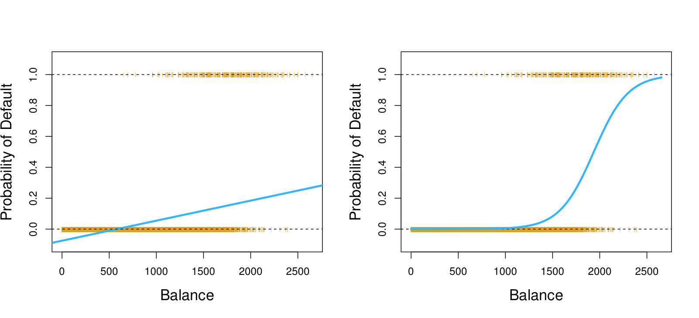

```{r knitr_init, echo=FALSE, cache=FALSE, message = FALSE}
library(knitr)
library(rmdformats)
library(ggplot2)
library(MASS)
library(dplyr)

## Global options
knitr::opts_chunk$set(echo = TRUE, message = FALSE, prompt = FALSE,
                      tidy = TRUE, comment = NA, warning = FALSE, cache = TRUE,
                      fig.height = 4, fig.width = 7, fig.retina = 2,
                      fig.align = "center")
custom_theme <- theme_bw(base_family = "Open Sans") +
        theme(legend.position = "right",
              axis.title.x = element_text(size = 11,
                                          margin = margin(10, 0, 0, 0),
                                          face = "bold"),
              axis.title.y = element_text(size = 11,
                                          margin = margin(0, 10, 0, 0),
                                          face = "bold"),
              plot.title = element_text(family = "Open Sans"),
              panel.grid.major = element_blank(),
              panel.grid.minor = element_blank(),
              panel.background = element_blank())
theme_set(custom_theme)
```

# 로지스틱 회귀분석 (Logistic Regression)

로지스틱 회귀분석은 앞서 공부한 선형회귀법과 같이 수치를 예측합니다. 하지만 선형회귀법은 정확한 수치를 예측하는 반면, 로지스틱 회귀분석은 0부터 1 사이의 값을 예측합니다. 정확하게 말하자면, 종속변수 $Y$를 직접 예측하는 것이 아닌 종속변수 $Y$가 어떤 범주에 속하는 *확률*을 모델링합니다. 이런 이유에서 로지스틱 회귀분석은 회귀 모델(Regression Model)이라기 보다는 분류 모델(Classification Model)로 불립니다.

예를 들어, 통장 잔고에 따른 파산 여부를 예측하고자 합니다. 각각의 변수명을 `balance`, `default`라고 하겠습니다. 파산 여부는 `Yes`와 `No`로 구분할 수 있죠. 로지스틱 회귀분석을 통해 모델링을 한다면 현재 통장 잔고의 상황에서 파산일 확률을 모델링하는 것이죠. 이 내용을 수학적으로 쓴다면 조건부확률을 이용하여 이렇게 쓸 수 있을 겁니다.

$$
\operatorname{Pr}(\text{default $=$ Yes $\mid$ balance})
$$

만약 이 확률값이 0.5보다 크다면 모두 파산할 것이라고 예측할 수 있습니다. 반대로 0.5보다 작다면 파산하지 않았겠죠. 여기서 로지스틱 회귀분석을 사용하는 당위성을 알 수 있습니다.

만약 이러한 확률값 모델링을 선형회귀법을 통해서 수행했다고 가정합시다. 그렇다면 굉장히 간단한 수식으로 확률값을 모델링 할 수 있을 겁니다. 하지만 문제는 확률값인데도 불구하고 그 결과값이 0과 1 사이의 값이 아닐 수 있다는 점이죠. 당장에 0 미만인 경우 해당값은 확률의 의미를 잃어버립니다. 따라서 선형적인 함수가 아닌 0과 1 사이의 값을 제공하는 다른 함수를 사용해야 합니다. 로지스틱 회귀분석에서는 아래와 같은 **로지스틱 함수(Logistic Function)**를 사용합니다.

$$
p(X) = \frac{e^X}{1 + e^{X}}
$$

여기서 $X = \beta_0 + \beta_1 x_1 + \cdots + \beta_n x_n$ 입니다. 위 식은 이렇게 표현할 수도 있습니다.

$$
\begin{aligned}
p(X) (1 + e^X) &= e^X \\
p(X) + p(X) \cdot e^X &= e^X \\
p(X) &= e^X - p(X) \cdot e^X \\
p(X) &= e^X (1 - p(X)) \\
\frac{p(X)}{1 - p(X)} &= e^X = e^{\beta_0 + \beta_1 x_1 + \cdots + \beta_n x_n} \\
\log \left( \frac{p(X)}{1 - p(X)} \right) &= X = \beta_0 + \beta_1 x_1 + \cdots + \beta_n x_n.
\end{aligned}
$$

$p(X) / (1-p(X))$는 **공산(odds)**이라 하여 0과 $\infty$ 사이의 값을 가집니다. 만약 $p(X)$ 값이 1에 가까워진다면 공산값이 $\infty$에 가까워지며, 반대로 $p(X)$ 값이 0에 가까워진다면 공산값은 0에 가까워집니다. 이 공산에 로그를 취하면 마지막 식인 **로그 공산(log-odds)**, **로짓(logit)**이 됩니다. 로지스틱 회귀모델은 선형적인 로짓을 갖습니다.



각각의 변수에 대해서 한 유닛 증가는 로그 공산을 해당 변수의 계수만큼 변화시킨다고 생각하시면 됩니다. 이 때 증가 변화량은 직선이 아님을 알아두셔야 합니다. 로지스틱 회귀모델은 로지스틱 함수에 적합하고 있으니까요.

# 로지스틱 회귀분석 실습 (Lab : Logistic Regression)

## 1. 대학 입학 예측 (Colleage Admissions Prediction)

대학교 4년 과정의 학점 `gpa`와 대학원 입학 시험 점수 `gre`, 그리고 출신 대학의 명성 `rank`를 사용해서 입학 여부 `admit`을 예측해보려 합니다. 주어진 데이터를 임포트하겠습니다.

```{r}
admission <- read.csv("binary.csv")
head(admission)
str(admission)
summary(admission)

xtabs(~ admit + rank, data = admission)
```

`admit`과 `rank`를 요인형 데이터로 바꾸도록 하겠습니다.

```{r}
admission$admit <- factor(admission$admit)
admission$rank <- factor(admission$rank)
```

```{r}
ggplot(data = admission, aes(x = admit, y = gre, color = admit)) + 
        geom_boxplot()

ggplot(data = admission, aes(x = admit, y = gpa, color = admit)) +
        geom_boxplot()

ggplot(data = admission, aes(x = gpa, y = gre, color = admit)) +
        geom_point(alpha = .5)
```

```{r}
library(MASS)
library(dplyr)
set.seed(12345)
train <- sample_frac(admission, 0.7)
trainIdx <- as.numeric(row.names(train))
test <- admission[-trainIdx, ]
```

이제 단순하게 로지스틱 회귀분석을 해보죠. 로지스틱 회귀분석은 `glm()` 함수를 이용해 `family = binomial`을 명시해주면 됩니다.

```{r}
logit_admit <- glm(admit ~ gre + gpa + rank, data = train, family = 'binomial')
summary(logit_admit)
```

로그공산을 중심으로 본 모델을 설명하면 다음과 같습니다..

- `gre`에서 한 단위가 증가할 때마다, log odds는 0.001331 증가한다.  
- `gpa`에서 한 단위 증가할 때마다, log odds는 0.806846 증가한다.  
- `rank`의 경우, `rank == 1`인 경우가 베이스라인 피처(baseline feature)이며, `rank == 2`이면 log odds가 0.484687, `rank == 3`이면 1.475998, `rank == 4`이면 1.436535만큼 감소한다.

```{r}
x <- predict(logit_admit, test)
predict_admit <- predict(logit_admit, test, type = "response")
binary_admit <- ifelse(predict_admit > 0.5, 1, 0)

sigmoid <- function(x){1 / (1 + exp(-x))}

ggplot(data = data.frame(x = x, y = predict_admit, binary = binary_admit)) + 
        geom_jitter(aes(x = x, y = y), width = 0.1, height = 0.1, alpha = .5) +
        coord_cartesian(ylim = c(0, 1), xlim = c(-3, 3)) + 
        stat_function(fun = sigmoid, xlim = c(-3, 3), color = "#56A9F6") +
        geom_point(aes(x = x, y = binary), shape = "|", color = "#f18f2e", size = 2) +
        xlab(NULL) + ylab(NULL)

accuracy <- function(actual, predict){
        return(sum(actual == predict) / length(actual))
}

accuracy(test$admit, binary_admit)
```

```{r}
library(caret)
confusionMatrix(binary_admit, test$admit)
```


```{r}
ranktest <- admission %>%
        group_by(rank) %>%
        summarise(gre = mean(gre), gpa = mean(gpa))
ranktest$rankProb <- predict(logit_admit, ranktest, type = "response")
ranktest
```

========================================

```{r}
tmp <- with(admission, data.frame(gre=rep(seq(200, 800, length.out=100), 4), gpa=mean(gpa), rank = factor(rep(1:4, each = 100))))

# Get probabilities and standard errors (for plotting)
probs <- cbind(tmp, predict(logit_admit, newdata=tmp, type='link', se=TRUE))
# Get a look at this new data
head(probs)

probs <- within(probs, {
        PredProb <- plogis(fit) # fit logistic curve
        LL <- plogis(fit - (1.96 * se.fit)) # create lower limits
        UL <- plogis(fit + (1.96 * se.fit))
})

ggplot(probs, aes(x=gre, y=PredProb)) +
        geom_ribbon(aes(ymin=LL, ymax=UL, fill=rank), alpha=0.2) + 
        geom_line(aes(color=rank))
```


## 2. 주식 시장 예측 (Stock Market Prediction)

사용할 데이터는 `ISLR` 패키지에서 가져오겠습니다. 이 데이터셋은 2001년에서 2005년까지 1,250일에 걸친 S&P 500 주가지수의 수익률 퍼센테이지로 구성되어 있으며, 각 날짜에 그 날 이전의 5일의 각 거래일 `Lag1`에서 `Lag5`에 대한 수익률이 기록되어 있습니다. 또한 전날에 거래된 주식 수를 10억 주 단위로 표시한 `Volume`, 당일의 수익률 `Today`, 당일 주가지수의 상승 여부 `Direction`으로 구성되어 있습니다.

```{r}
library(ISLR)
str(Smarket)
summary(Smarket)
```

데이터에서 칼럼간 상관관계를 확인해보도록 하죠. 마지막 칼럼은 요인형이므로 수치형 데이터에 대해서만 계산할 수 있는 상관계수를 계산할 수 없습니다.

```{r}
cor(Smarket[-ncol(Smarket)])
```

`Year`와 `Volume` 사이의 Positive correlation을 제외하고는 높은 상관관계는 보이지 않음을 알 수 있습니다.

```{r}
ggplot(data = Smarket, aes(x = 1:nrow(Smarket), y = Volume)) + 
        geom_point(aes(colour = factor(Year)), alpha = .5) +
        geom_smooth(fill = NA, method = "lm", colour = "#56A9F6") +
        xlab("Index") +
        theme(legend.position = "bottom",
              legend.title = element_blank(),
              legend.key = element_blank())
```

트레이닝 데이터로 2001년부터 2004년의 데이터를, 테스트 데이터로 2005년 데이터를 사용하도록 하겠습니다.

```{r}
library(dplyr)
train <- filter(Smarket, Year != 2005)
test <- filter(Smarket, Year == 2005)
```

로지스틱 회귀는 `glm()` 함수를 이용해 `family = binomial`을 명시해주면 됩니다.

```{r}
stock <- glm(Direction ~ Lag1 + Lag2 + Lag3 + Lag4 + Lag5 + Volume,
             data = train, family = binomial)
summary(stock)
```

결과가 매우 형편없습니다. 모델에서 전체적으로 각 변수에 대한 회귀계수들의 z-value가 매우 작고, 이에 대한 p-value 역시 매우 높습니다. 그나마 `Lag1`의 p-value가 가장 낮구요. 추정된 회귀계수는 음수인데, 이 말은 즉슨 전날의 수익률이 양수이면 오늘 주가지수가 상승할 가능성이 낮다는 이야기입니다. 위 모델을 가지고 예측을 하더라도 좋은 결과는 얻기 힘들 것으로 보입니다.

```{r}
stock_pred <- predict(stock, test, type = "response")
predictedStock <- rep("Down", nrow(test))
predictedStock[stock_pred > 0.5] <- "Up"
table(predictedStock)
table(predictedStock, test$Direction)

accuracy(test$Direction, predictedStock)
```

`hatvalues()` : 레버리지 관측치 확인

이 중에서 가장 낮은 p-value를 보이는 네 개의 변수를 선택해서 다시 모델링을 해보도록 하겠습니다.

```{r}
stock2 <- glm(Direction ~ Lag1 + Lag2 + Lag3, data = train, family = binomial)
summary(stock2)
stock_pred <- predict(stock2, test, type = "response")
predictedStock2 <- rep("Down", nrow(test))
predictedStock2[stock_pred > 0.5] <- "Up"
accuracy(test$Direction, predictedStock2)
```

59.1%의 정확도를 보입니다. 아까보다 10% 가량 좋아졌지만 아직은 부족한 수치죠. 이 모델을 개선하는 방법은 선형회귀법에서 했던 방법들과 크게 다르지 않습니다. 가장 좋은 방법은 레버리지가 관측되는 데이터와 이상치를 삭제하는 것입니다. 우선 모델에 대해서 더 알아보도록 하죠.

```{r}
par(mfrow = c(2, 2))
plot(stock2)
```

마지막 그래프를 통해서 레버리지가 높은 관측치들이 다수 존재하는 것을 알 수 있습니다. 이 점들이 몇 번째 인스턴스인지 확인할 때는 `hatvalues()` 함수를 사용합니다. 이 때 레버리지가 0.025보다 높은 점들을 찾아보겠습니다.

```{r}
leverage <- hatvalues(stock2)
leveragePoint <- which(leverage > 0.025)

cleanedStock <- train[-leveragePoint, ]
stock3 <- glm(Direction ~ Lag1 + Lag2 + Lag3, data = cleanedStock, family = binomial)
summary(stock3)
stock_pred <- predict(stock3, test, type = "response")
predictedStock3 <- rep("Down", nrow(test))
predictedStock3[stock_pred > 0.5] <- "Up"
accuracy(test$Direction, predictedStock3)
```

```{r}
library(caret)
confusionMatrix(predictedStock2, test$Direction)
confusionMatrix(predictedStock3, test$Direction)
```

Accuracy는 약 1% 정도 감소했지만, `Up`인 경우의 예측률이 약 81.6%로 굉장히 높게 측정되었습니다. 이와 반대로 `Down`인 경우는 예측률이 약 6% 더 낮아졌죠. `Up`에 대해서는 적절히 일반화되었다고 볼 수 있지만, 반대로 `Down`인 경우에는 과적합되었다고 생각할 수 있습니다. 실제로 `leveragePoint`에 해당하는 데이터가 `Down`이 더 많습니다.
