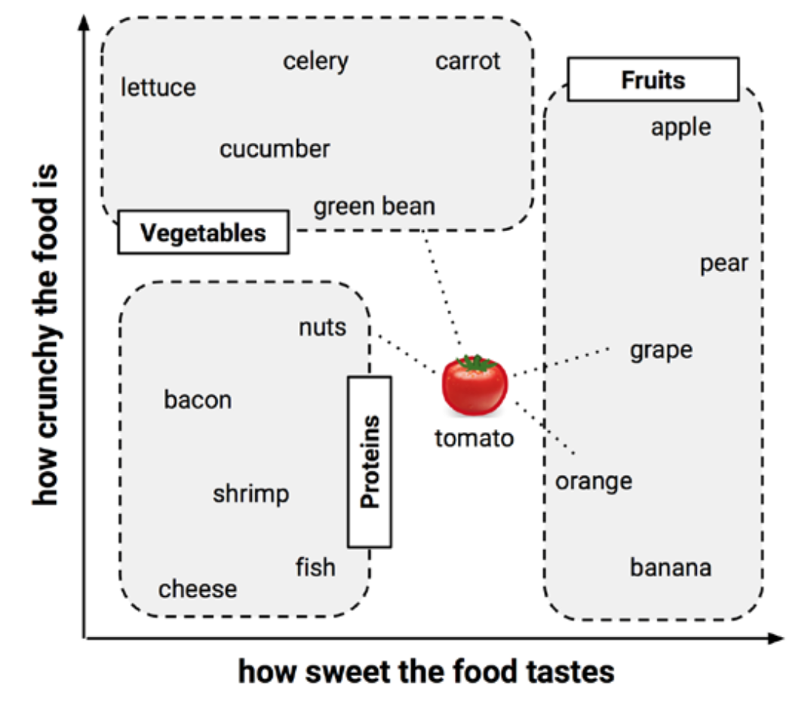

```{r knitr_init, echo=FALSE, cache=FALSE, message = FALSE}
library(knitr)
library(rmdformats)
library(ggplot2)
library(MASS)
library(dplyr)

## Global options
knitr::opts_chunk$set(echo = TRUE, message = FALSE, prompt = FALSE, tidy = TRUE, comment = NA, warning = FALSE, cache = TRUE, fig.height = 4, fig.width = 7, fig.retina = 2, fig.align = "center")
custom_theme <- theme_bw(base_family = "Open Sans") +
        theme(legend.position = "right",
              axis.title.x = element_text(size = 11, margin = margin(10, 0, 0, 0), face = "bold"),
              axis.title.y = element_text(size = 11, margin = margin(0, 10, 0, 0), face = "bold"),
              plot.title = element_text(family = "Open Sans"),
              panel.grid.major = element_blank(),
              panel.grid.minor = element_blank(),
              panel.background = element_blank())
theme_set(custom_theme)
```

# k Nearest Neighbor

k-최근접 이웃(k Nearest Neighbor)은 유명한 분류 모델 중 하나입니다. 트레이닝 데이터셋이 다양한 범주를 가지고 있다고 가정해봅시다. 어디에 속하는 지 모르는 새로운 데이터에 대해서 가장 유사한 범주로 분류시키는 모델이 바로 k-최근접 이웃입니다.

k-최근접 이웃은 매우 단순합니다. 여러 음식들을 단맛과 아삭함을 기준으로 2차원 평면에 나타내보도록 하겠습니다.



이 때, 기존의 음식들을 채소, 과일, 단백질류 세 범주로 나눌 수 있습니다. 범주 내의 음식들은 서로 유사성이 있기 때문에 서로 간의 거리가 매우 가깝습니다. 여기에 토마토를 중간에 넣어보겠습니다. 넣는 위치는 단맛의 정도와 아삭함의 정도에 기반을 둡니다. 토마토를 세 범주 중 하나로 분류하는 방법은 간단합니다. 가장 가까운 $k$개의 데이터를 확인하기만 하면 됩니다. 그림에서는 포도와 오렌지, 호두와 콩이 가장 가까운 네 개의 데이터입니다. 따라서 이 모델에서는 토마토를 과일로 분류합니다.

k-최근접 이웃에서 가장 중요한 요소는 거리와 $k$값입니다. 새로운 데이터가 기존의 데이터와 얼마나 유사한 지 확인하기 위해서는 거리값을 사용합니다. 이 때, 일반적으로 **유클리드 거리(Euclidean Distance)**를 사용합니다. 우리가 평소에 사용하는 거리 개념입니다. 가끔은 **맨하탄 거리(Manhattan Distance)**를 사용하기도 합니다. 실제 맨하탄 거리가 사각형으로 잘 정돈되어 있다는 특징에서 나온 개념입니다. 이 개념들 외에도 **코사인 유사도(Cosine Similarity)**나 **피어슨 상관계수(Pearson Correlation)** 등을 사용합니다.


$k$값은 새로운 데이터를 기존 데이터와 몇 개를 비교할 지 정하는 값이다. 이 때, $k$값은 범주 개수의 배수로 두지 않는 것이 좋다. 동점이 나올 수도 있기 때문이죠. 예를 들어서 $k = 10$인 경우에, 두 범주에서 각각 다섯 개의 데이터와 가깝다고 한다면 새로운 데이터의 범주를 선택하기에 문제가 생기죠. 따라서 이런 경우를 배제하기 위하여 $k$값을 범주 개수의 배수로 두지 않습니다.

또한 너무 작은 $k$값과 너무 큰 $k$값을 설정하는 것도 문제가 됩니다. 만약 $k$값이 너무 작으면 노이즈에 많은 영향을 받고, 과적합이 발생할 수도 있죠. 하지만, $k$값이 너무 크면 처음부터 데이터가 많이 속해있는 범주로 수렴할 수 밖에 없습니다. 경계가 불분명해지기도 하구요. 따라서 우리는 적당한 $k$값을 찾아서 모델을 구축해야 합니다.

하지만, 이 $k$값을 설정하는 방법은 정해진 바가 없습니다. 어림잡기 방법(Rule of Thumbs)을 사용하는 경우도 있지만, 결국은 선험적인 방법을 통해서 설정하게 됩니다.

k-최근접 이웃 알고리즘은 **게으른 학습(Lazy Learning)**의 일종입니다. 데이터를 학습한다기 보다는 저장해놓고, 다른 데이터가 들어오길 기다리기 때문입니다. 따라서 훈련 단계는 굉장히 빠르지만, 실제 예측 과정은 상대적으로 느린 축에 속합니다. 다른 알고리즘들은 대부분 **열정적인 학습(Eager Learning)**에 속하죠.

$k$-최근접 이웃 알고리즘은 단순하고 효율적이며 데이터 분산에 대한 추가적인 추정이 필요가 없다는 장점이 있습니다. 또한 위에서 말했듯이 훈련 시간도 빠르죠.
하지만 실제 예측과정이 많이 느립니다. 데이터 포인트 사이의 거리를 구해야 되기 때문이죠. 또한 명목형 데이터와 결측 데이터에 대해서는 추가적인 처리가 필요합니다.

# 실습 : 유방암 진단 (Breast Cancer Wisconsin Diagnostic)

사용할 데이터셋은 유방암 진단 데이터입니다. 디지털화된 유방 덩어리의 미세 침흡인물의 이미지로부터 측정된 일련의 데이터가 포함되어 있죠.

```{r}
wbcd <- read.csv("wisc_bc_data.csv", stringsAsFactors = FALSE)
str(wbcd)
```

`str()` 함수를 통해서 알아본 결과, 569개의 observation, 32개의 feature로 구성되어 있음을 알 수 있습니다. 각각은 다음과 같습니다.

| 변수명 | 설명 |
|:-----:|:------:|
| `id` | 환자 식별자|
| `radius` | 반지름 |
| `texture`| 텍스쳐 |
| `perimeter` | 둘레 |
| `area` | 면적 |
| `smoothness` | 평활도 |
| `compactness` | 다짐도 |
| `concavity` | 요면 |
| `points` | 요면점 |
|`symmetry` | 대칭 |
|`dimension` | 프랙탈 차원|

이 때, 환자 식별자 `id`는 랜덤으로 정렬되어 있기 때문에 트레이닝 데이터와 테스트 데이터를 나눌 때 임의대로 나누어도 큰 문제가 되지 않음을 알 수 있습니다. 또한 각 변수의 뒤의 접미사들인 `mean`, `se`, `worst`는 각각 평균, 표준편차, 가장 나쁜값을 의미합니다. 

## Data Preprocessing

```{r}
# Remove the attribute 'id'
wbcd <- wbcd[-1]

# The variable that we need to predict
table(wbcd$diagnosis)
```

여기서 B는 양성(Benign), M은 악성(Malignant)를 나타냅니다. 즉, M이라고 나타난 부분이 실제 암세포가 있는 환자들입니다. 기존의 데이터 레이블에 정확한 정보를 부여하겠습니다.

```{r}
wbcd$diagnosis <- factor(wbcd$diagnosis, levels = c("B", "M"),
                         labels = c("Benign", "Malignant"))

prop.table(table(wbcd$diagnosis))
```

## Build a model

```{r}
wbcd_train_labels <- wbcd[1:400, 1]
wbcd_test_labels <- wbcd[401:nrow(wbcd), 1]

wbcd_train <- wbcd[1:400, -1]
wbcd_test <- wbcd[401:nrow(wbcd), -1]
```

처음 kNN을 실행할 때 k의 값을 정하는 것이 가장 큰 문제입니다. 일반적으로 Rule of Thumbs에 의해 전체 데이터의 제곱근으로 잡는 경우가 많습니다. 이 때, 짝수를 설정하면 문제가 생길 수 있는데, 예를 들어 `k = 20`으로 설정하여 만약 10개씩으로 나눠질 경우 랜덤으로 배정이 됩니다. 모델을 구축할 때마다 결과가 달라지죠. 따라서 일반적으로 홀수로 설정하여 모델을 구축합니다.

```{r}
library(class)  # for kNN
library(caret)

wbcd_pred <- knn(train = wbcd_train, test = wbcd_test, cl = wbcd_train_labels, k = 21)

confusionMatrix(wbcd_pred, wbcd_test_labels)
```

Recall = Specificity는 54/63으로 85.7%입니다. 실제 악성인데, 양성으로 나온 경우가 63번 중 9번이나 된다는 것은 다소 치명적이죠. 전체 Accuracy는 94.7%로 높지만, 실제 상황에서는 Specificity가 낮으므로 굉장히 위험한 모델이 됩니다.

## Model Improvement

모든 변수에 대해서 값들의 분포가 서로 너무 다릅니다. 이 값들을 모두 normalize해서 0과 1 사이의 숫자로 나타내면 값들의 분포가 균일해질겁니다.

```{r}
normalize <- function(x){
        return ((x - min(x)) / (max(x) - min(x)))
}

wbcd_n <- as.data.frame(lapply(wbcd[2:31], normalize))
summary(wbcd_n)

wbcd_train <- wbcd_n[1:400, -1]
wbcd_test <- wbcd_n[401:nrow(wbcd), -1]

wbcd_pred2 <- knn(train = wbcd_train, test = wbcd_test, cl = wbcd_train_labels, k = 21)

confusionMatrix(wbcd_pred2, wbcd_test_labels)
```

### Model Evaluation

```{r}
Result <- data.frame(k = NULL, Accuracy = NULL, Sensitivity = NULL, Specificity = NULL, PosPredValue = NULL, NegPredValue = NULL)
sequence <- seq(1, 30, by = 2)
for(i in sequence){
        pred <- knn(train = wbcd_train, test = wbcd_test, cl = wbcd_train_labels, k = i)
        confMat <- confusionMatrix(pred, wbcd_test_labels)
        currentResult <- data.frame(k = i, Accuracy = confMat$overall[1], Sensitivity = confMat$byClass[1],
                Specificity = confMat$byClass[2], PosPredValue = confMat$byClass[3], NegPredValue = confMat$byClass[4])
        Result <- bind_rows(Result, currentResult)
}

Result

library(reshape2)
moltenResult <- melt(Result, id.vars = "k")

ggplot(data = moltenResult, aes(x = k, y = value, color = variable)) + 
        geom_line() + 
        scale_x_continuous(breaks = sequence) +
        geom_vline(mapping = aes(xintercept = 11), linetype = "dashed", alpha = .5)
```

### Z-scaling + Model Evaluation

```{r}
wbcd_z <- as.data.frame(lapply(wbcd[2:31], scale))
summary(wbcd_z)

wbcd_train_z <- wbcd_z[1:400, -1]
wbcd_test_z <- wbcd_z[401:nrow(wbcd), -1]

wbcd_pred3 <- knn(train = wbcd_train_z, test = wbcd_test_z, cl = wbcd_train_labels, k = 21)

confusionMatrix(wbcd_pred3, wbcd_test_labels)

Result2 <- data.frame(k = NULL, Accuracy = NULL, Sensitivity = NULL, Specificity = NULL, PosPredValue = NULL, NegPredValue = NULL)
sequence <- seq(1, 30, by = 2)
for(i in sequence){
        pred <- knn(train = wbcd_train_z, test = wbcd_test_z, cl = wbcd_train_labels, k = i)
        confMat <- confusionMatrix(pred, wbcd_test_labels)
        currentResult <- data.frame(k = i, Accuracy = confMat$overall[1], Sensitivity = confMat$byClass[1],
                Specificity = confMat$byClass[2], PosPredValue = confMat$byClass[3], NegPredValue = confMat$byClass[4])
        Result2 <- bind_rows(Result2, currentResult)
}

Result2

moltenResult <- melt(Result2, id.vars = "k")

ggplot(data = moltenResult, aes(x = k, y = value, color = variable)) + 
        geom_line() + 
        scale_x_continuous(breaks = sequence) +
        geom_vline(mapping = aes(xintercept = 11), linetype = "dashed", alpha = .5)
```

전체적으로 z-scaling보다는 max-min scaling의 결과가 훨씬 좋음을 알 수 있습니다.

# Clustering

**군집화(Clustering)**은 주어진 데이터를 구분할 수 있는 클래스(class)에 대한 지식이 *없는* 상태에서, 각 데이터들의 유사도에 근거하여 데이터를 구분하는 방법론을 말합니다. 지금까지 배웠던 모든 방법론은 **지도 학습(Supervised Learning)**이었던 반면, 군집화는 **비지도 학습(Unsupervised Learning)**입니다.

군집화 기법은 매우 다양합니다. 데이터의 형태나 크기 등에 대하여 서로 다른 알고리즘을 사용하게 됩니다. 오늘은 다양한 알고리즘 중에서 가장 자주 사용하는 세 알고리즘에 대해서 공부하겠습니다.

## k-Means

k-Means 알고리즘은 군집화 알고리즘 중에 가장 대중적인 알고리즘입니다. 가장 단순한 알고리즘이죠. 주어진 데이터를 $k$개의 군집(Cluster)로 묶는 알고리즘입니다. 이 때, 각 클러스터의 중심값이 해당 군집 데이터들의 **평균**으로 구해지기 때문에, 알고리즘 이름이 k-Means Algorithm입니다.

군집의 개수를 설정하고, 평균을 구하는 과정에서는 거리 개념이 들어갑니다. k-최근접 이웃과 유사하죠. 데이터 포인트와 중심점까지의 거리가 최소가 되는 중심점을 찾는 것이 이 알고리즘의 특징입니다. 이 때, 사용되는 방법은 바로 SSE(The Sum of Squared Error)입니다.

$$
E = \sum^k_{i=1} \sum_{p \in C_i} \operatorname{dist} (p, c_i)^2.
$$

```{r}
library(gridExtra)
data(iris)
head(iris)

iris_kMeans <- kmeans(iris[1:4], centers = 3)
iris$kMeans <- factor(iris_kMeans$cluster)
kcenters <- data.frame(iris_kMeans$centers)

table(iris$kMeans, iris$Species)

gg1 <- ggplot() +
        geom_point(data = iris, aes(x = Sepal.Length, y = Sepal.Width, color = kMeans)) + 
        geom_point(data = kcenters, aes(x = Sepal.Length, y = Sepal.Width)) +
        geom_point(data = kcenters, aes(x = Sepal.Length, y = Sepal.Width), size = 5, shape = 10)

gg2 <- ggplot(data = iris, aes(x = Sepal.Length, y = Sepal.Width, color = Species)) +
        geom_point()

grid.arrange(gg1, gg2, ncol = 2)
```

각 군집화 알고리즘들은 각기 다른 장단점을 가지고 있습니다. k-Means Algorithm의 경우 단순한 알고리즘 덕분에 큰 데이터에도 쉽게 사용할 수 있고, 이에 따라서 확장성이 매우 큽니다(Scalable).
하지만 적절한 $k$값을 고르는 것이 굉장히 어려우며, 평균값을 사용하기 때문에 노이즈와 이상치에 대해서 매우 약한 모습을 보입니다. 그 뿐만 아니라, 원형 군집(Convex-shaped Data)이 아닌 경우에는 사용하기 어렵습니다.

## k-Medoids

k-Medoids는 k-Means와 유사하지만 메인 아이디어가 크게 다릅니다. k-Means의 경우 평균값을 통해서 클러스터의 중심값을 구하기 때문에, 실제 데이터 포인트가 아닌 곳에도 중심이 생길 수 있습니다. 하지만 k-Medoids 알고리즘의 경우, 클러스터의 중심점이 실제 데이터 포인트가 됩니다. 이런 특징 때문에 k-Means 알고리즘과 다르게 노이즈와 이상치에 대해서 매우 견고하다는(Robust) 성질을 가지고 있습니다.

하지만, Medoids를 구할 때 계속해서 다른 데이터 포인트와의 거리를 반복해서 계산해야 되기 때문에 알고리즘의 실행 시간은 데이터가 커지는 정도의 제곱에 비례해서 커지게 됩니다. 따라서 큰 데이터에 대해서는 사용하기 힘들다는 단점이 있죠. 추가적으로 $k$값을 정하는 문제나 기존의 k-Means가 가지고 있는 단점인 원형 군집에만 사용할 수 있다는 단점도 가지고 있습니다.

k-Medoids 알고리즘은 k-Means 알고리즘과 다르게 AEC(Absolute-Error Criterion)을 사용합니다.

$$
E = \sum^k_{i=1} \sum_{p \in C_i} \operatorname{dist} (p, o_i)^2.
$$


```{r}
library(cluster)
pam_iris <- pam(iris[1:4], k = 3)
iris$pam <- factor(pam_iris$clustering)
pamcenter <- data.frame(pam_iris$medoids)

table(iris$pam, iris$Species)

gg3 <- ggplot() +
        geom_point(data = iris, aes(x = Sepal.Length, y = Sepal.Width, color = pam)) + 
        geom_point(data = pamcenter, aes(x = Sepal.Length, y = Sepal.Width)) +
        geom_point(data = pamcenter, aes(x = Sepal.Length, y = Sepal.Width), size = 5, shape = 10)

grid.arrange(gg1, gg3, ncol = 2)
```

## DBSCAN

DBSCAN 알고리즘은 위의 두 알고리즘과 많이 다릅니다. 우선 가장 큰 차이점은 원형 군집이 아닌 임의의 형태의 군집이라도 군집화가 가능합니다. 심지어 S자 형태의 군집도 파악해낼 수 있습니다. 이게 가능해진 이유는 DBSCAN 알고리즘의 특징 때문입니다.
DBSCAN 알고리즘은 어떤 **핵심 오브젝트(Core object)**를 시작으로 밀도가 높은 이웃 데이터들을 찾아냅니다. 그렇게 묶인 이웃들은 하나의 클러스터가 됩니다. 밀도가 낮은 데이터들은 군집으로 형성되지 못하고 이상치로 남게 됩니다. 정말 밀집되어 있는 클러스터들만 남게 되죠.

하지만 DBSCAN 알고리즘도 단점이 있습니다. 각 데이터들 사이의 계속 반복해서 계산해야되기 때문에 알고리즘 실행 시간이 길어집니다. k-Medoids와 같이 데이터 크기의 제곱에 비례하죠. 그 뿐만 아니라, 알고리즘 실행을 위한 매개변수(Parameters)가 너무 많습니다. 얼마나 가깝고 많은 점들로 구성되어 있어야 '조밀하다(dense)'라고 정의할 수 있을까에 대한 문제죠. 이 때 쓰이는 매개변수는 `eps`와 `MinPts`입니다. `eps`는 최대 거리, `MinPts`는 최소 점의 개수입니다.

```{r}
library(factoextra)
df <- multishapes[, 1:2]

kmeans_df <- kmeans(df, 5)

km <- ggplot(data = df, aes(x = x, y = y, color = factor(kmeans_df$cluster))) + 
        geom_point() + 
        theme(legend.position = "null")
km

library(fpc)
dbscan <- dbscan(df, eps = 0.15, MinPts = 5)
dbscan_Index <- factor(dbscan$cluster)

db <- ggplot(data = df, aes(x = x, y = y, color = dbscan_Index)) + 
        geom_point() + 
        theme(legend.position = "null")
db

grid.arrange(km, db, ncol = 2)
```

