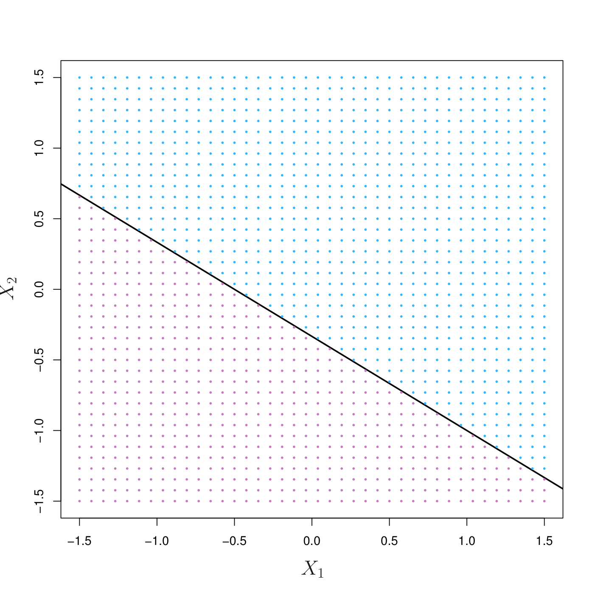
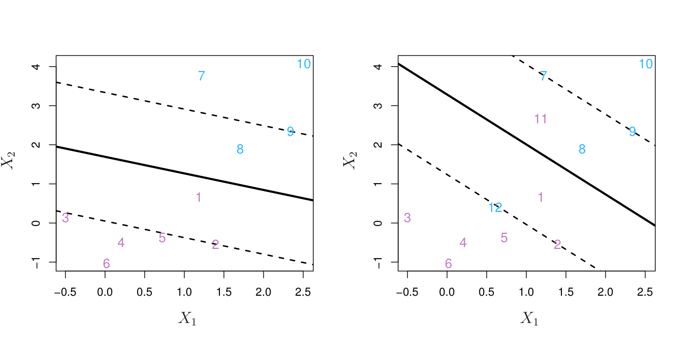
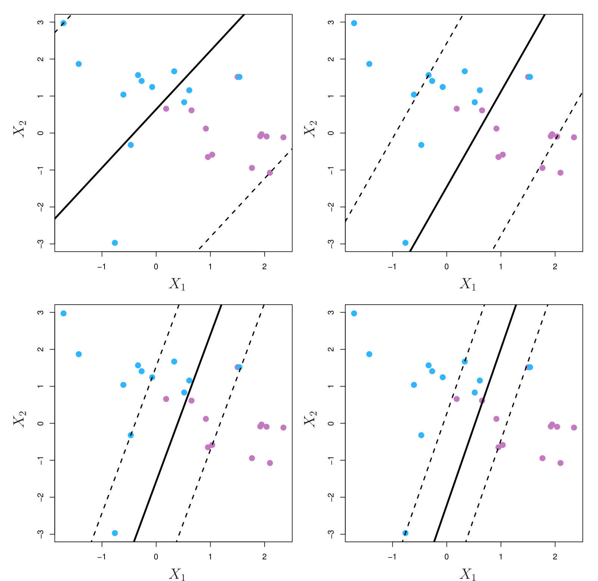
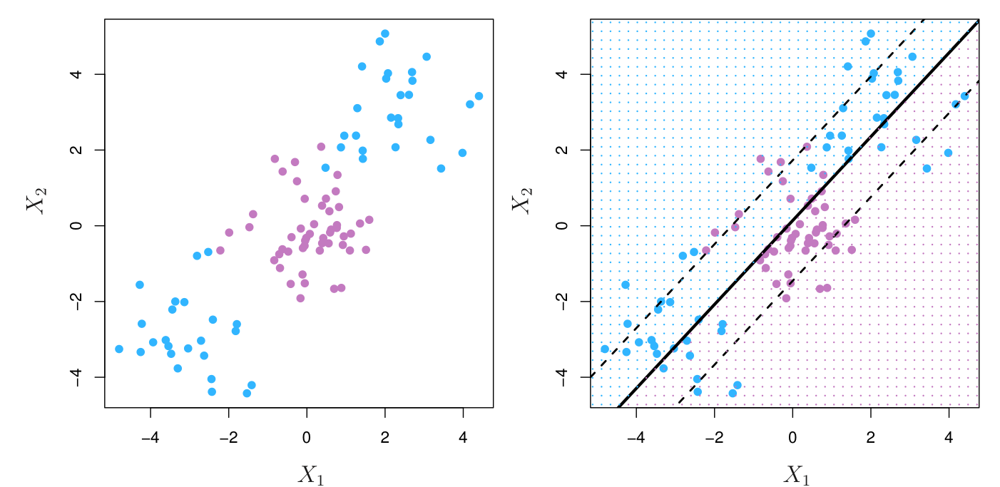

```{r knitr_init, echo=FALSE, cache=FALSE, message = FALSE}
library(knitr)
library(rmdformats)
library(ggplot2)
library(MASS)
library(dplyr)

## Global options
knitr::opts_chunk$set(echo = TRUE, message = FALSE, prompt = FALSE,
                      comment = NA, warning = FALSE, cache = TRUE,
                      fig.height = 4, fig.width = 7, fig.retina = 2,
                      fig.align = "center")
custom_theme <- theme_bw(base_family = "Open Sans") +
        theme(legend.position = "right",
              axis.title.x = element_text(size = 11, margin = margin(10, 0, 0, 0), face = "bold"),
              axis.title.y = element_text(size = 11, margin = margin(0, 10, 0, 0), face = "bold"),
              plot.title = element_text(family = "Open Sans"),
              panel.grid.major = element_blank(),
              panel.grid.minor = element_blank(),
              panel.background = element_blank())
theme_set(custom_theme)
```

# Support Vector Machine

서포트 벡터 머신(Support Vector Machine, SVM)은 1990년대에 개발된 분류 기법입니다. 현재 가장 일반적인 상황에서 좋은 성능을 보이는 비선형 분류기 중 하나입니다.
하지만, 그 기본 개념이 굉장히 어렵기 때문에 본 강의에서는 서포트 벡터 머신이 나오게 된 역사를 차근차근 되짚어보도록 하겠습니다.

# History of SVM

## 1962, Maximal Margin Classifier

일반적인 유클리드 공간에 대해서 **초평면(Hyperplane)**을 정의해봅시다. 간단하게 원점(Origin)이 어디인지 알 수 없는 평면을 초평면이라고 합니다. 2차원 공간에서의 초평면은 선이 되죠. 이 초평면은 기존의 공간을 반으로 나눕니다.

```{r, out.width = '400pt', fig.retina = 2, echo = FALSE}

```

위 이미지는 초평면 $1 + 2X_1 + 3X_2 = 0$을 나타내고 있습니다. 윗쪽 파란색 영역은 해당 초평면에 대해서 $1 + 2X_1 + 3X_2 > 0$인 점들의 집합이고, 보라색 영역은 $1+2X_1 + 3X_2 < 0$인 점들의 집합입니다.

두 개의 클래스로 나뉘어진 어떤 데이터 포인트들이 유클리드 공간에 놓여져 있다고 생각해봅시다. 이 때, 해당 데이터 포인트들에 대해서 클래스를 완벽하게 나눌 수 있는 초평면이 있다고 가정해보죠. 이 초평면을 **분리 초평면(Sepration Hyperplane)**이라고 합니다. 이러한 분리 초평민이 존재한다면, 무한히 많은 분리 초평면이 존재할겁니다. 이미 존재하는 분리 초평면에서 1mm만 움직여도 분리 초평면이 되기 때문이죠. 이 중에서, 가장 적절한 분리 초평면은 데이터로부터 가장 거리가 먼 분리 초평면일겁니다. 앞으로 이 성질을 갖는 초평면을 **최대 마진 초평면(Maximal Margin Hyperplane)**이라고 부를겁니다. 이 최대 마진 초평면을 이용한 분류기가 바로 **최대 마진 분류기(Maximal Margin Classifier)**입니다. 최대 마진 초평면과 관련된 여러 가지 용어는 PPT 자료에 첨부하였습니다.

최대 마진 분류기의 문제는 일반적인 상황에서 모든 데이터를 올바르게 나눌 수 없다는 점입니다. 모든 데이터에 대해서 완벽하게 분리할 수 있는 분리 초평면이 존재할 때만 최대 마진 분류기가 존재하죠. 이제 여기서, 조금의 타협을 보도록 하겠습니다.

## 1996, Soft Margin Classifier

```{r, out.width = '600pt', fig.retina = 2, echo = FALSE}

```

오분류된 데이터 일부를 허용할 수 있는 모델을 생각해보겠습니다. 이 때, '일부'의 정의를 잘 내리면 단단한(Robust) 모델을 만들 수 있을 것 같습니다. 그렇게 나온 개념이 바로 **슬랙 변수(Slack variable)**입니다. 슬랙 변수는 데이터 포인트의 위치를 나타냅니다.

- $e = 0$ : 올바르게 분류되었다.  
- $1 > e > 0$ : 올바르게 분류되었으나, 마진을 넘어서는 범위에 있다.  
- $e > 1$ : 올바르게 분류되지 않았다.

이제 각각의 데이터 포인트에 대해서 슬랙 변수값을 구한 후 모두 더합니다. 이 더한 값이 얼마나 많은 변수들이 오분류되었는 지 말해줄겁니다.

하지만 이 값이 너무 커버리면 제대로 분류가 되지 않는 모델이 나올겁니다. 따라서 이 값에 한계를 주는 최대 비용(Maximum Cost)를 설정해줍니다. 서포트 벡터 머신에서 가장 중요한 Tuning Parameter인 $C$입니다. 이 값에 따라서 모델이 굉장히 많이 바뀌게 됩니다.

- $C$값이 크면 : 과소적합(Underfitting)  
- $C$값이 작으면 : 과적합(Overfitting)

```{r, out.width = '600pt', fig.retina = 2, echo = FALSE}

```

이 모델을 우리는 **소프트 마진 분류기(Soft Margin Classifier)** 또는 **서포트 벡터 분류기(Support Vector Classifier)**라고 부릅니다. 이렇게 유연한 모델을 만들었지만, 결국 이런 문제는 언제나 발생합니다. 어떻게 해결해야 할까요?

```{r, out.width = '600pt', fig.retina = 2, echo = FALSE}

```

## 1992, Kernel Trick

많은 머신러닝 연구자들은 위 이미지와 같은 문제를 해결하기 위해서 여러 가지 방법을 고안했습니다. 그 중에서 지금까지도 널리 쓰이는 해결법은 수학에서 나왔습니다. 바로 **커널 트릭(Kernel Trick)**입니다.

커널 트릭이란 어떤 변수 공간에 **커널 함수(Kernel function)**을 사용하여 그 공간을 확장시키는 방법입니다. 복잡하게 말하자면 커널 함수를 사용해서 데이터의 경계를 결정하는 결정경계면을 계산하고 클래스를 분류합니다. 커널 트릭을 사용하면 복잡한 형태의 데이터라도 결정경계면을 계산하여 클래스를 올바르게 분류할 수 있습니다. 다양한 커널 함수가 있지만 자주 사용하는 네 가지만 알아보도록 하겠습니다.

1. Linear Function : $K_l(x_i, x_j) = \langle x_i, x_j \rangle$  
2. Polynomial Kernel : $K_p(x_i, x_j) = (\gamma \cdot \langle x_i, x_j \rangle + r)^d$  
3. Gaussian Radial Basis Kernel : $K_r(x_i, x_j) = e^{-\gamma \cdot |x_i - x_j|^2}$, where $\gamma > 0$  
4. Sigmoid Kernel : $K_s(x_i, x_j) = \tanh (\gamma \cdot \langle x_i, x_j \rangle + r)$  

여기서 $\gamma$, $r$, $d$ 값은 정해줘야 하는 파라미터로 이 값들에 따라서 결정경계면에 큰 차이가 생깁니다.

## Toy Data

```{r}
library(e1071)
set.seed(10111)
x = matrix(rnorm(40), 20, 2)
y = rep(c(-1, 1), c(10, 10))
x[y == 1, ] = x[y == 1, ] + 1

toy <- data.frame(x, y = factor(y))
ggplot(toy, aes(x = X1, y = X2)) + 
        geom_point(color = y + 2)

svm.fit <- svm(y ~ ., data = toy, kernel = 'linear', cost = 10, scale = FALSE)
summary(svm.fit)
plot(svm.fit, toy, grid = 100)
```

```{r}
library(mlr)
toy.task <- makeClassifTask(id = "Toy", data = toy, target = "y")
learner <- makeLearner("classif.svm", kernel = "linear", cost = 10, scale = FALSE)
print(plotLearnerPrediction(learner, toy.task))
```


```{r}
make.grid = function(x, n = 75) {
        grange = apply(x, 2, range)
        x1 = seq(from = grange[1, 1], to = grange[2, 1], length = n)
        x2 = seq(from = grange[1, 2], to = grange[2, 2], length = n)
        expand.grid(X1 = x1, X2 = x2)
}
xgrid = make.grid(x)
ygrid = predict(svm.fit, xgrid)
beta = drop(t(svm.fit$coefs) %*% x[svm.fit$index, ])
beta0 = svm.fit$rho
plot(xgrid, col = c("red", "blue")[as.numeric(ygrid)], pch = 20, cex = 0.2)
points(x, col = y + 3, pch = 19)
points(x[svm.fit$index, ], pch = 5, cex = 2)
abline(beta0/beta[2], -beta[1]/beta[2])
abline((beta0 - 1)/beta[2], -beta[1]/beta[2], lty = 2)
abline((beta0 + 1)/beta[2], -beta[1]/beta[2], lty = 2)
```


```{r}
set.seed(1)
x <- matrix(rnorm(200 * 2), ncol = 2)
x[1:100, ] <- x[1:100, ] + 2
x[101:150, ] = x[101:150, ] - 2
y <- c(rep(1, 150), rep(2, 50))
toy2 <- data.frame(x=x,y=as.factor(y))

ggplot(data = toy2, aes(x = x.1, y = x.2, color = y)) + 
        geom_point()

svm2 <- svm(y ~ ., data = toy2, kernel = 'radial', gamma = 2, cost = 1, scale = FALSE)
plot(svm2, toy2)
```

```{r}
xgrid = make.grid(x)
names(xgrid) <- c("x.1", "x.2")
ygrid <- predict(svm2, xgrid) 
plot(xgrid, col = as.numeric(ygrid), pch = 20, cex = 0.2)
points(x, col = y, pch = 19)

func = predict(svm2, xgrid, decision.values = TRUE)
func = attributes(func)$decision
xgrid = make.grid(x)
names(xgrid) <- c("x.1", "x.2")
ygrid <- predict(svm2, xgrid) 
plot(xgrid, col = as.numeric(ygrid), pch = 20, cex = 0.2)
points(x, col = y, pch = 19)
points(svm2$SV, pch = 5, cex = 1.5)

px1 <- unique(xgrid$x.1)
px2 <- unique(xgrid$x.2)
contour(px1, px2, matrix(func, 75, 75), level = 0, add = TRUE, col = "red")
contour(px1, px2, matrix(func, 75, 75), level = 1, add = TRUE, col = "black")
```

```{r}
toy.task <- makeClassifTask(id = "Toy", data = toy2, target = "y")
learner <- makeLearner("classif.svm", kernel = "radial", cost = .5, gamma = 1, scale = FALSE)
print(plotLearnerPrediction(learner, toy.task))
```


## Diabetes Diagnostics

```{r}
library(e1071)
library(rpart)
library(mlbench)
library(MASS)
library(dplyr)
```

```{r}
data(Pima.tr)
data(Pima.te)
str(Pima.tr)
str(Pima.te)
summary(Pima.tr)
summary(Pima.te)
test_labels <- Pima.te$type
```

```{r, eval=FALSE}
library(caret)
linear.tune <- tune.svm(type ~ ., data = Pima.tr, kernel = "linear", cost = c(0.001, 0.001, 0.1, 1, 5, 10))
summary(linear.tune)

best.linear <- linear.tune$best.model
linear.test <- predict(best.linear, Pima.te)
confusionMatrix(linear.test, test_labels)
```

```{r, eval=FALSE}
poly.tune <- tune.svm(type ~., data = Pima.tr, kernel = "polynomial", degree = c(2, 3, 4, 5), 
                      coef0 = c(0.1, 0.5, 1, 2, 3, 4), cost = c(0.001, 0.001, 0.1, 1, 5, 10))
summary(poly.tune)
best.poly <- poly.tune$best.model
poly.test <- predict(best.poly, Pima.te)
confusionMatrix(poly.test, test_labels)
```

```{r, eval=FALSE}
radial.tune <- tune.svm(type ~., data = Pima.tr, kernel = "radial", gamma = c(0.1, 0.5, 1, 2, 3, 4), cost = c(0.001, 0.001, 0.1, 1, 5, 10))
summary(radial.tune)
best.radial <- radial.tune$best.model
radial.test <- predict(best.radial , Pima.te)
confusionMatrix(radial.test, test_labels)
```

```{r, eval=FALSE}
sig.tune <- tune.svm(type ~., data = Pima.tr, kernel = "sigmoid", gamma = c(0.1, 0.5, 1, 2, 3, 4),
                     coef0 = c(0.1, 0.5, 1, 2, 3, 4), cost = c(0.001, 0.001, 0.1, 1, 5, 10))
summary(sig.tune)
best.sig <- sig.tune$best.model
sig.test <- predict(best.sig, Pima.te)
confusionMatrix(sig.test, test_labels)
```


## With Scaling
```{r, eval=FALSE}
train_n <- data.frame(apply(Pima.tr[, -8], 2, scale), type = Pima.tr$type)
test_n <- data.frame(apply(Pima.te[, -8], 2, scale), type = Pima.te$type)
```


```{r, eval=FALSE}
linear.tune <- tune.svm(type ~ ., data = train_n, kernel = "linear", cost = c(0.001, 0.001, 0.1, 1, 5, 10))
summary(linear.tune)

best.linear <- linear.tune$best.model
linear.test <- predict(best.linear, test_n)
confusionMatrix(linear.test, test_labels)
```
```{r, eval=FALSE}
poly.tune <- tune.svm(type ~., data = train_n, kernel = "polynomial", degree = c(2, 3, 4, 5), 
                      coef0 = c(0.1, 0.5, 1, 2, 3, 4), cost = c(0.001, 0.001, 0.1, 1, 5, 10))
summary(poly.tune)
best.poly <- poly.tune$best.model
poly.test <- predict(best.poly, test_n)
confusionMatrix(poly.test, test_labels)
```

```{r, eval=FALSE}
radial.tune <- tune.svm(type ~., data = train_n, kernel = "radial", gamma = c(0.1, 0.5, 1, 2, 3, 4), cost = c(0.001, 0.001, 0.1, 1, 5, 10))
summary(radial.tune)
best.radial <- radial.tune$best.model
radial.test <- predict(best.radial , test_n)
confusionMatrix(radial.test, test_labels)
```

```{r, eval=FALSE}
sig.tune <- tune.svm(type ~., data = train_n, kernel = "sigmoid", gamma = c(0.1, 0.5, 1, 2, 3, 4),
                     coef0 = c(0.1, 0.5, 1, 2, 3, 4), cost = c(0.001, 0.001, 0.1, 1, 5, 10))
summary(sig.tune)
best.sig <- sig.tune$best.model
sig.test <- predict(best.sig, test_n)
confusionMatrix(sig.test, test_labels)
```

